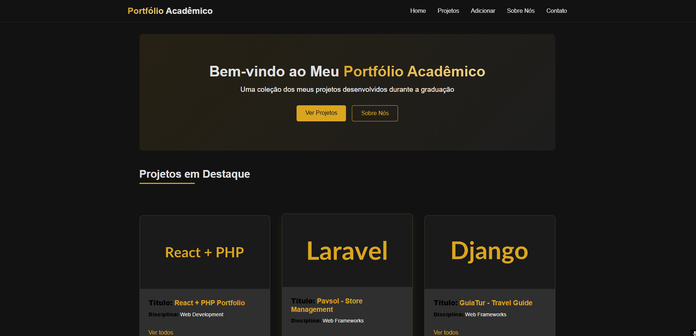

# React PHP Portfolio



A portfolio project manager built with a React frontend and a PHP/MySQL REST API. The app lists academic projects and supports creating, editing, deleting, uploading project images, and attaching compressed project files.

## Stack

- React 19
- React Router 7
- Create React App
- PHP
- MySQL

## Folder Structure

```text
frontend/   React application and UI assets
backend/    PHP REST API, database connection, and SQL schema
uploads/    Runtime upload directory for project images and files
```

## Run the Frontend

```bash
cd frontend
npm install
npm start
```

The React app runs at `http://localhost:3000` by default.

## Run the Backend

1. Serve the repository through Apache/PHP so the backend is reachable at:

```text
http://localhost/react-php-portfolio/backend/index.php
```

2. Create the MySQL database and table:

```bash
mysql -u root -p < backend/db/criarTab.sql
```

3. Update local database settings in `backend/db/parametro.php` if your MySQL host, database, username, or password differ from the defaults.

4. Make sure the `uploads/` directory is writable by PHP. This folder is not versioned and must be created manually if it does not exist.

## API Endpoints

Base URL:

```text
http://localhost/react-php-portfolio/backend/index.php
```

| Method | Endpoint | Description |
| --- | --- | --- |
| `GET` | `/backend/index.php` | List all projects |
| `GET` | `/backend/index.php?id={id}` | Get one project |
| `POST` | `/backend/index.php` | Create a project with `multipart/form-data` |
| `POST` | `/backend/index.php?id={id}` with `_method=PUT` | Update a project with `multipart/form-data` |
| `DELETE` | `/backend/index.php?id={id}` | Delete a project |

Create/update form fields:

- `title`
- `description`
- `discipline`
- `image` optional image file
- `file` optional `.zip`, `.rar`, or `.7z` file
